# Relay mission envelope — diagram book

SysML-style views expressed in Mermaid. These are readable architecture diagrams, not a formal SysML execution model. Numerical values come from the configuration and Python calculations; physical evidence remains provisional.

## Reading order

| View | Diagram | Purpose |
|---|---|---|
| D01 | Mission context | Operational context |
| D02 | Service requirements | Requirement view |
| D03 | Recovery requirements | Requirement view |
| D04 | Interface and evidence requirements | Requirement view |
| D05 | Operational use cases | Use-case view |
| D06 | Mission functions | Activity-style view |
| D07 | Logical blocks | Block-definition-style view |
| D08 | Physical composition | Block-definition-style view |
| D09 | Airborne interfaces | Internal-block-style view |
| D10 | Service and carrier interfaces | Internal-block-style view |
| D11 | Mission lifecycle | State-machine view |
| D12 | Installed mass constraint | Parametric-style view |
| D13 | Energy and reserve constraint | Parametric-style view |
| D14 | Supported dwell constraint | Parametric-style view |
| D15 | Configuration decision | Activity-style analysis view |
| D16 | Propulsion power constraint | Parametric-style view |
| D17 | Segment energy constraint | Parametric-style view |

## D01 — Mission context

A-to-B service crosses the relay aircraft. Carrier command/status is a separate path; terrain constrains the service geometry.

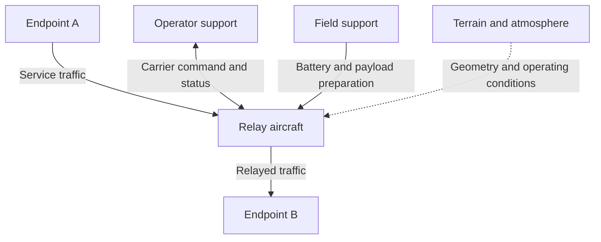

## D02 — Service requirements

Engineering requirements derive from the service need. Dashed verify links identify check responsibilities; they do not claim demonstrated communications performance.

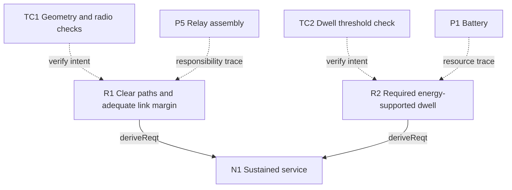

## D03 — Recovery requirements

Energy, installed mass and continuous demand constrain the planned sortie. Thresholds remain illustrative and actual recovery has not been demonstrated.

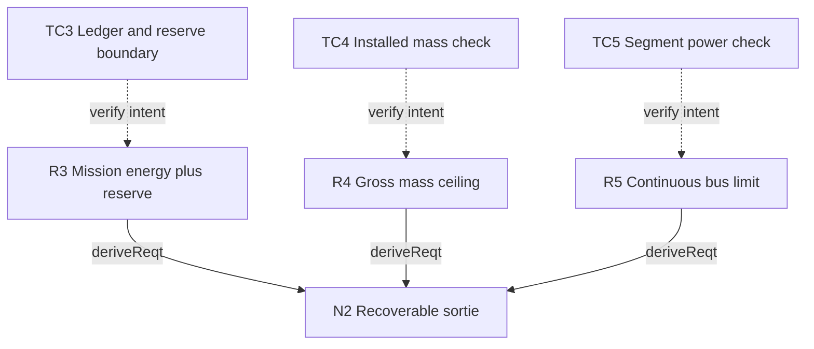

## D04 — Interface and evidence requirements

Installation evidence, comparison records and reproducibility have different checks. The interface review remains open even when the numerical tests pass.

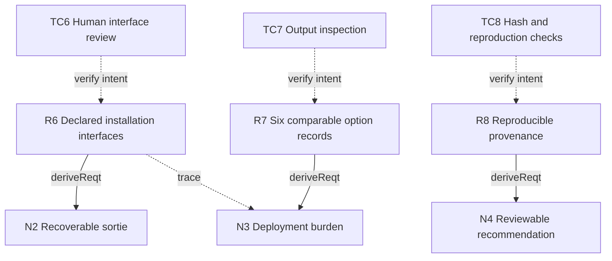

## D05 — Operational use cases

Rounded nodes represent use cases. Actor associations express participation, not execution order. Restore readiness is described but not simulated.

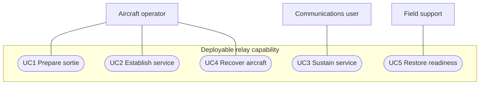

## D06 — Mission functions

Solid arrows indicate the nominal function sequence. Dashed arrows indicate supporting responsibilities, avoiding the suggestion that monitoring and power are extra timed flight segments.

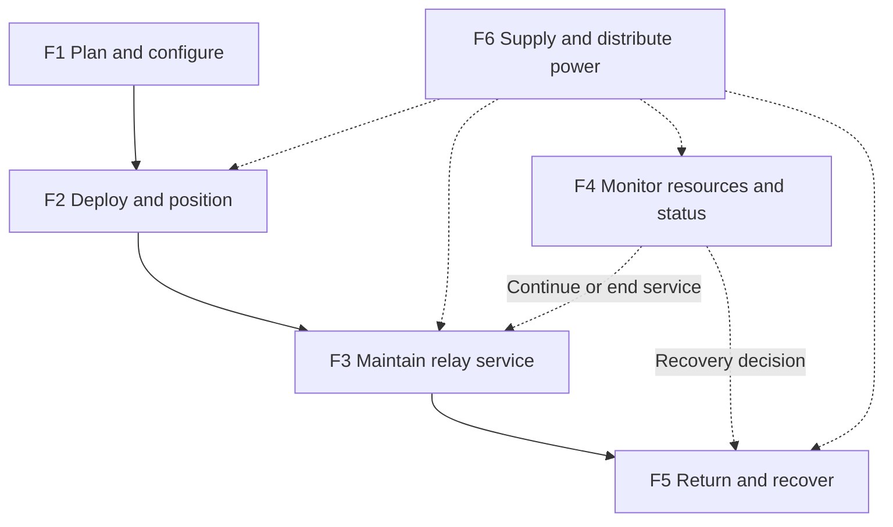

## D07 — Logical blocks

Composition groups responsibilities independently of hardware. Class compartments list responsibilities, not implemented software methods.

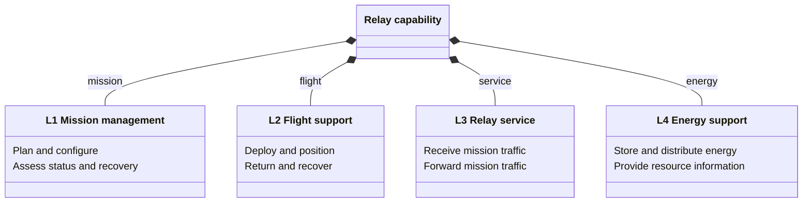

## D08 — Physical composition

Composition shows owned physical groups. Each box is a reusable block type; the labeled relationship is the part role. Both battery choices use this same structure.

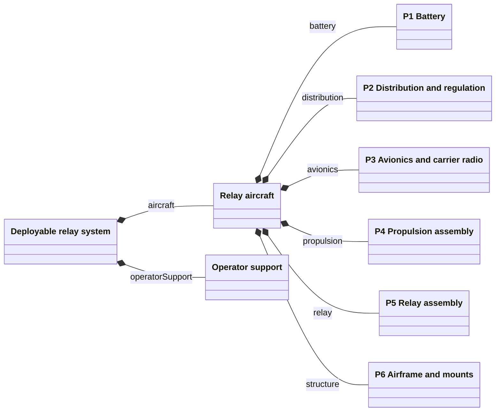

## D09 — Airborne interfaces

Solid edges carry electrical supply; the dashed edge carries flight commands. Interface types and conjugated port directions remain explicit in the model tables.

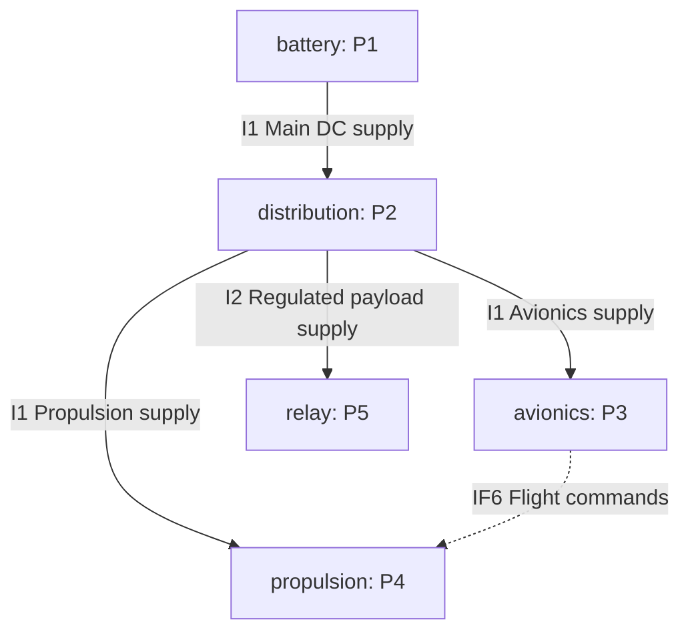

## D10 — Service and carrier interfaces

The served endpoints are external. Mission traffic and carrier control enter different aircraft responsibilities; no throughput or command-link reliability is demonstrated here.

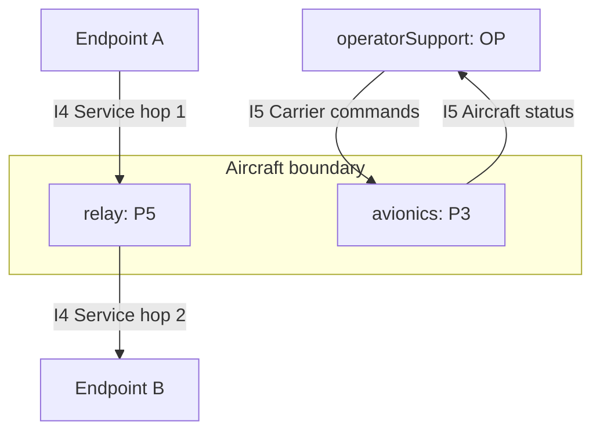

## D11 — Mission lifecycle

The diagram specifies intended operational decisions. The evaluator checks a planned sortie and does not implement live flight control or off-nominal recovery.

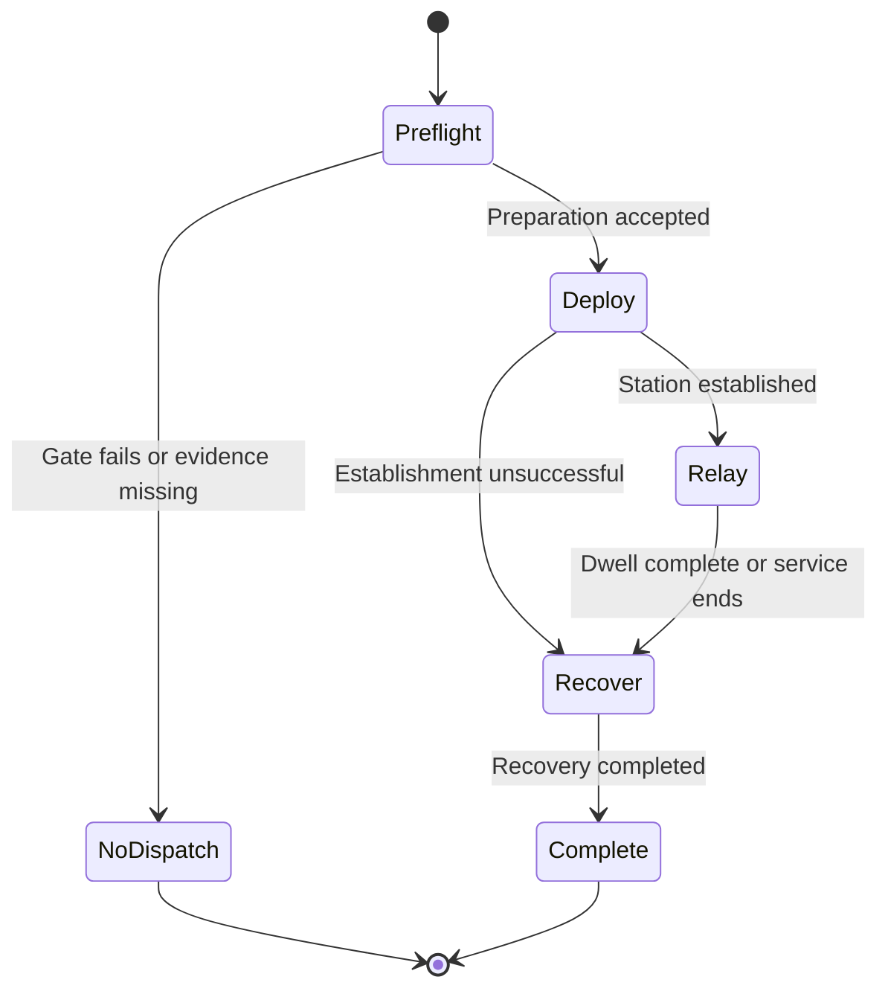

## D12 — Installed mass constraint

Undirected lines mean equality bindings between named values and constraint parameters. The mount increment is separate from pack mass. Python evaluates the relation.

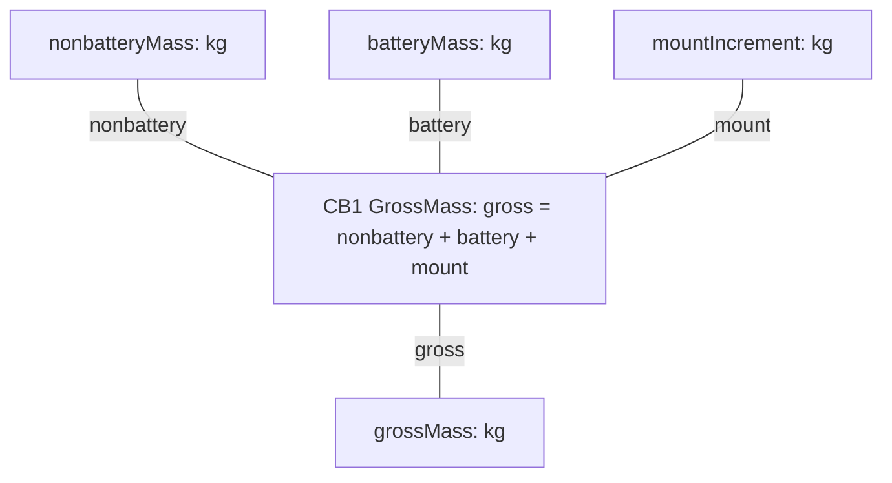

**Constraint:** gross = nonbattery + battery + mount

## D13 — Energy and reserve constraint

One reserve deduction is applied to usable energy. Binding lines state equality, not calculation order; the constraint expression is listed below the figure in the book.

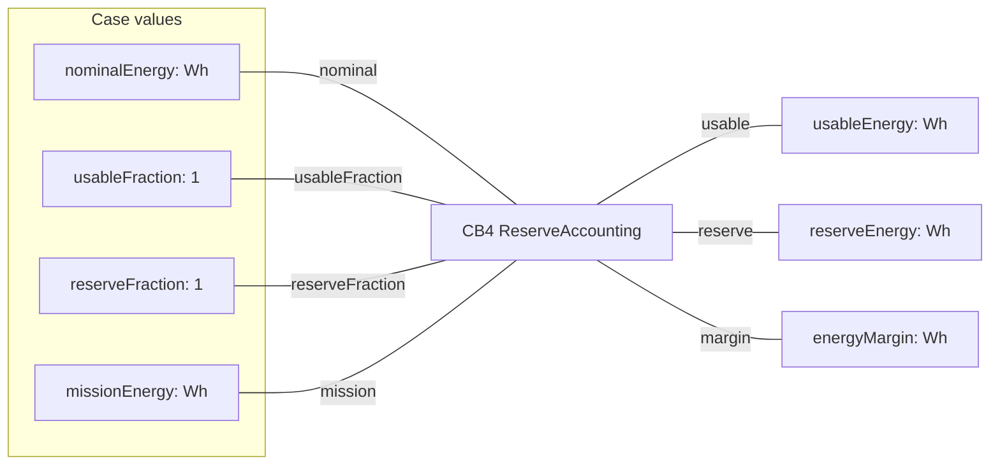

**Constraint:** usable = nominal × usableFraction; reserve = usable × reserveFraction; margin = usable − reserve − mission

## D14 — Supported dwell constraint

The maximum energy-supported dwell retains its sign. A negative value means the nonservice sortie already exceeds the allowance. Radio, mass and power checks still apply.

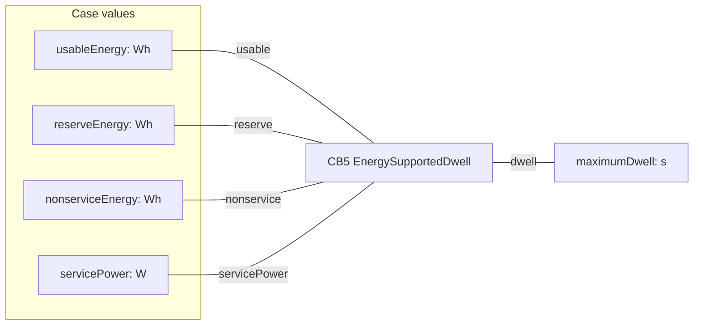

**Constraint:** dwell = (usable − reserve − nonservice) × 3600 / servicePower

## D15 — Configuration decision

Six options share one mission and requirement basis. The selection is provisional and never converts missing hardware or physical evidence into a pass.

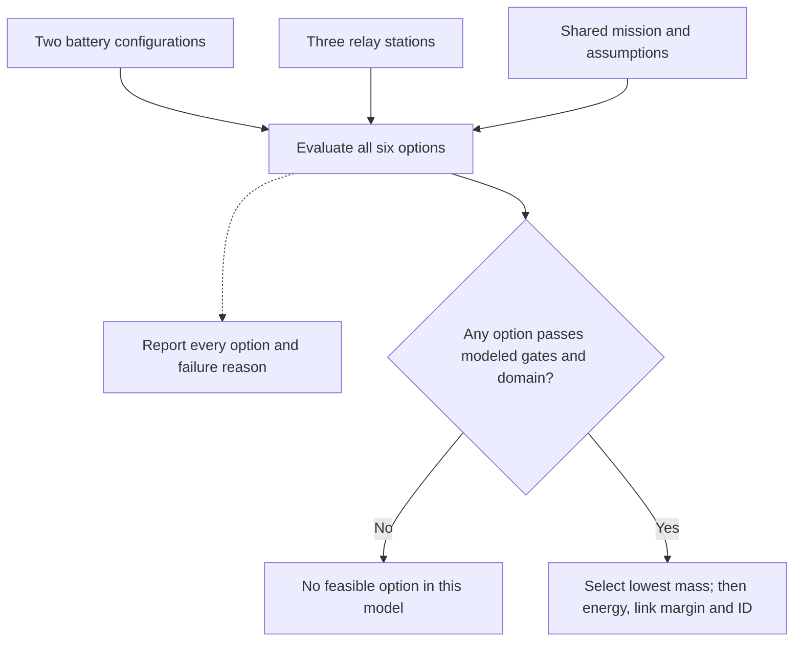

## D16 — Propulsion power constraint

Fixed rotor geometry and a propulsion-only reference operating point define the provisional hover electrical law. The shared multiplier is a sensitivity input, not a wind model.

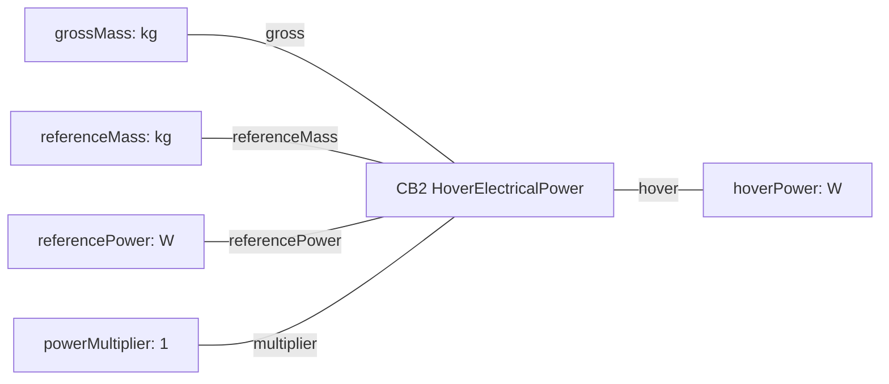

**Constraint:** hover = referencePower × (gross / referenceMass)^1.5 × multiplier

## D17 — Segment energy constraint

Propulsion and auxiliary loads are accounted at the main bus. The payload regulator loss enters once. Duration times power is converted from joules to Wh by dividing by 3600.

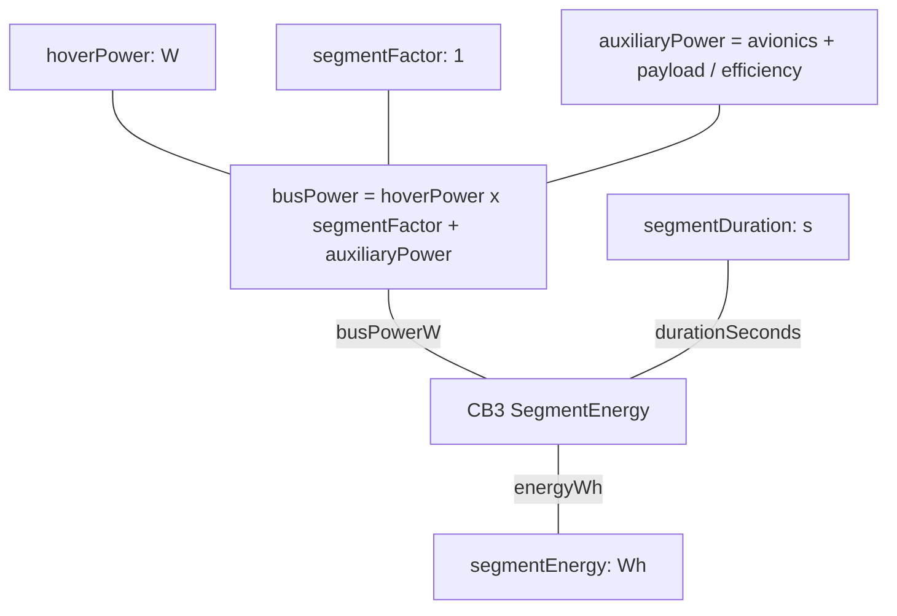

**Constraint:** busPower = hover × segmentFactor + avionics + payload / efficiency; energyWh = busPower × durationSeconds / 3600

## Notation and limits

Composition diamonds appear in the block-style class diagrams. Requirement arrows labeled deriveReqt point to the parent need. Verify links express check intent. Undirected parametric lines denote equality bindings; they are not execution arrows. Diagram labels summarize the registry and tables, which retain detailed properties and typed interfaces.

The activity-style decision view summarizes a batch comparison; it does not implement flight control. Read docs/architecture.md for allocations, mounting relationships and interface evidence.
