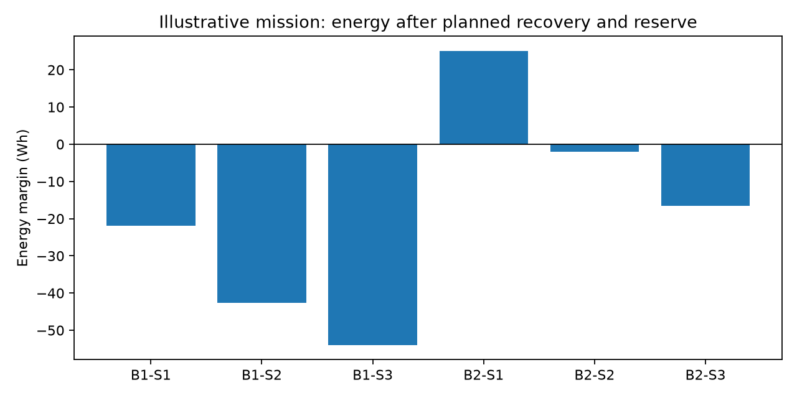
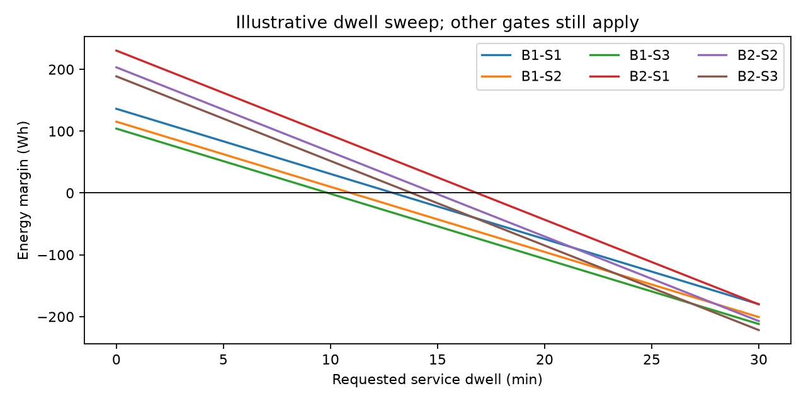
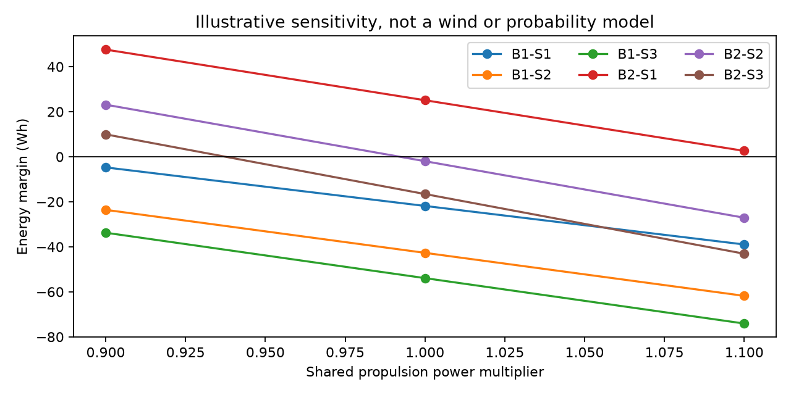
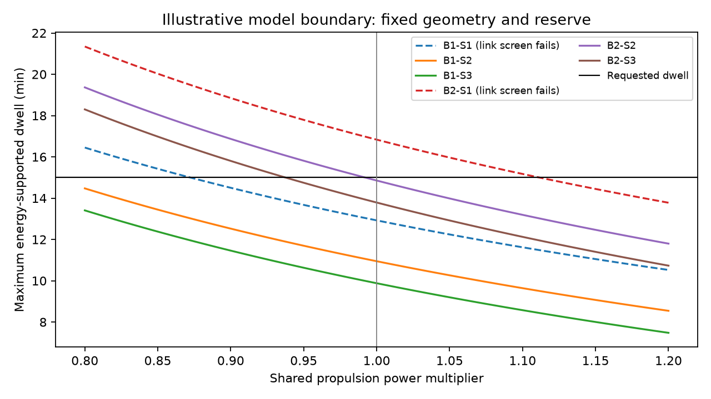

# Which option supports the mission?

The study compares two packs at three relay stations. All six use the same aircraft, payload, link requirements and 15-minute service request. See [the generated result](../results/summary.md) and [full ledgers](../results/baseline.json).

First reject options failing the modeled link, energy, mass or continuous-power screen, or falling outside the assumed model range. Among remaining options choose lowest gross mass, then greatest energy margin, then greatest minimum hop margin, then ID. Hardware compatibility and physics remain unreviewed, so selection is provisional.

The model also reports nondominated passing options in gross mass and maximum energy-supported dwell. This is a small configuration trade, not a search over all possible aircraft.

| Station | Position ENU m | What changes |
|---|---|---|
| S1 convenient | 250, 0, 50 | Short trip; wall may block the far hop |
| S2 balanced | 600, 0, 100 | Balanced service hops; longer flight |
| S3 elevated | 700, 0, 150 | Greater height; extra climb and recovery demand |

A positive energy bar alone does not retain an option. Inspect failed requirement IDs in the result. The relay is assumed to forward one-way A-to-B traffic with adequate scheduling; no packet-rate guarantee is derived from received power.

The sweep changes only service duration. The intercept includes establishment, both flight legs, climb and descent. Negative maximum dwell means even the nonservice sortie cannot fit inside the energy allowance.

A shared propulsion multiplier tests whether the decision is sensitive to the provisional power estimate. It does not model wind or claim a probability distribution. Michael will replace illustrative sensitivity with evidence-based physical bounds where possible.

The recommendation is generated from the inputs and reported in `results/summary.md`; do not hand-edit the winner. Preserve failures even if they make the comparison less dramatic.

## Decision boundary

The [generated decision brief](../results/decision-brief.md) explains each failure and the exact shared-power break-even values.

Dashed curves retain stations failing the fixed link screen. This is a calculated one-parameter boundary, not Michael's future evidence-based physical uncertainty figure.
